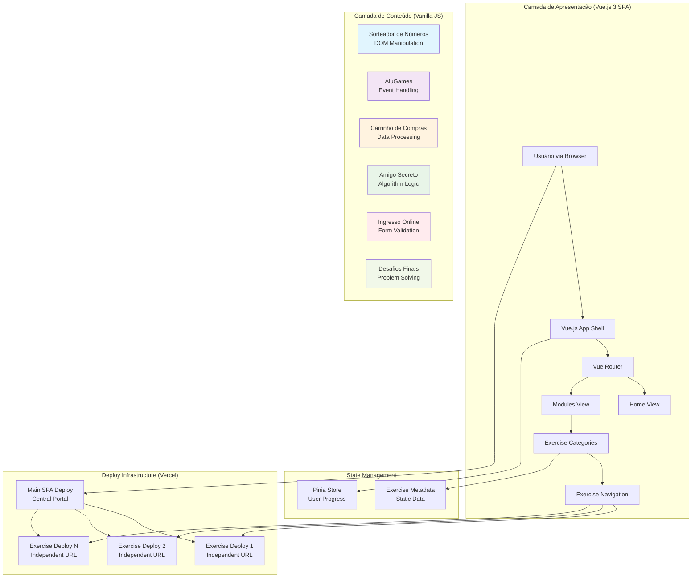

# Praticando Lógica com JavaScript: Plataforma de Exercícios Interativos

**Da Teoria à Práxis: Solidificando Fundamentos de Programação através de Desafios Práticos e Interativos.**

<p align="center">
  <a href="https://praticando-logica-js.vercel.app/" target="_blank" rel="noopener noreferrer">
    
  </a>
</p>

---

## Abstract (Resumo Técnico)

O projeto **Praticando Lógica com JavaScript** representa uma solução educacional abrangente e tecnicamente robusta para um dos desafios mais críticos no ensino de programação: a transição efetiva do conhecimento teórico para a aplicação prática de conceitos fundamentais. No contexto da crescente demanda por desenvolvedores qualificados e a necessidade de recursos educacionais interativos e acessíveis, o projeto aborda diretamente o problema da lacuna entre compreender sintaxe JavaScript e aplicar raciocínio lógico de forma proficiente na construção de aplicações web funcionais. A solução proposta materializa-se como uma arquitetura educacional dual: um núcleo composto por mini-projetos autocontidos desenvolvidos em HTML, CSS e JavaScript vanilla que cobrem conceitos fundamentais como manipulação do DOM, estruturas de controle, funções e estruturas de dados; e uma plataforma sofisticada de apresentação construída como Single Page Application (SPA) com Vue.js 3, que serve como portal interativo para organização e acesso estruturado aos desafios. A metodologia principal emprega tecnologias modernas de frontend incluindo Vite para otimização de build, Vue Router para navegação declarativa, e Pinia para gerenciamento de estado, demonstrando práticas contemporâneas de desenvolvimento web. Os resultados mensuráveis incluem uma coleção extensiva de exercícios práticos que consolidam aprendizado através de aplicação direta, uma plataforma moderna que facilita descoberta e navegação do conteúdo educacional, e um sistema de deploy descentralizado que permite acesso independente a cada exercício. A contribuição inovadora do projeto reside na combinação estratégica de simplicidade pedagógica (vanilla JavaScript) com sofisticação técnica (Vue.js ecosystem), criando uma ferramenta educacional que não apenas facilita a prática deliberada da lógica de programação, mas também funciona como portfólio demonstrativo de competências técnicas em desenvolvimento web moderno.

## Badges Abrangentes

[](https://github.com/ESousa97/praticando-logica-js/blob/main/LICENSE)
[](https://github.com/ESousa97/praticando-logica-js)
[](https://github.com/ESousa97/praticando-logica-js/commits/main)
[](https://github.com/ESousa97/praticando-logica-js/issues)
[](https://github.com/ESousa97/praticando-logica-js/pulls)
[](https://github.com/ESousa97/praticando-logica-js)
[](https://github.com/ESousa97/praticando-logica-js/graphs/contributors)

## Sumário

1. [Introdução e Motivação](#introdução-e-motivação)
2. [🔗 Link Principal / Acesso ao Projeto](#-link-principal--acesso-ao-projeto)
3. [🎬 Demonstração Visual](#-demonstração-visual)
4. [Arquitetura do Sistema](#arquitetura-do-sistema)
5. [Decisões de Design Chave](#decisões-de-design-chave)
6. [✨ Funcionalidades Detalhadas (com Casos de Uso)](#-funcionalidades-detalhadas-com-casos-de-uso)
7. [🛠️ Tech Stack Detalhado](#️-tech-stack-detalhado)
8. [📂 Estrutura Detalhada do Código-Fonte](#-estrutura-detalhada-do-código-fonte)
9. [📋 Pré-requisitos Avançados](#-pré-requisitos-avançados)
10. [🚀 Guia de Instalação e Configuração Avançada](#-guia-de-instalação-e-configuração-avançada)
11. [⚙️ Uso Avançado e Exemplos](#️-uso-avançado-e-exemplos)
12. [🔧 API Reference](#-api-reference)
13. [🧪 Estratégia de Testes e Qualidade de Código](#-estratégia-de-testes-e-qualidade-de-código)
14. [🚢 Deployment Detalhado e Escalabilidade](#-deployment-detalhado-e-escalabilidade)
15. [📜 Licença e Aspectos Legais](#-licença-e-aspectos-legais)
16. [👥 Equipe Principal e Colaboradores Chave](#-equipe-principal-e-colaboradores-chave)
17. [❓ FAQ (Perguntas Frequentes)](#-faq-perguntas-frequentes)
18. [📞 Contato e Suporte](#-contato-e-suporte)

## Introdução e Motivação

O domínio efetivo da programação transcende amplamente o mero conhecimento sintático de uma linguagem, residindo fundamentalmente na capacidade de aplicar raciocínio lógico estruturado para modelar, analisar e resolver problemas complexos de forma sistemática e eficiente. No contexto específico do JavaScript e desenvolvimento web moderno, observa-se frequentemente uma lacuna crítica entre recursos educacionais que se concentram em conceitos isolados e descontextualizados, deixando estudantes e desenvolvedores iniciantes sem uma ponte clara para a integração prática desses conceitos na construção de aplicações funcionais e interativas.

As soluções educacionais existentes para este domínio frequentemente carecem de elementos essenciais como contextualização prática, progressão estruturada de dificuldade, feedback imediato através de interfaces visuais, ou a demonstração clara de como conceitos fundamentais se traduzem em funcionalidades reais de aplicações web. Muitas plataformas dependem de exercícios puramente teóricos, ambientes de desenvolvimento artificiais, ou exemplos triviais que falham em capturar a complexidade e nuances do desenvolvimento web real.

O **Praticando Lógica com JavaScript** emerge como uma solução educacional inovadora e tecnicamente sofisticada para esta problemática multifacetada, oferecendo uma experiência de aprendizado estruturada que combina fundamentos sólidos com aplicação prática. O projeto implementa uma arquitetura educacional dual: uma coleção cuidadosamente curada de mini-projetos desenvolvidos em JavaScript vanilla que funcionam como "laboratórios" práticos para consolidação de conceitos fundamentais, e uma plataforma moderna de apresentação construída com Vue.js 3 que demonstra a aplicação desses conceitos em contextos de desenvolvimento contemporâneo.

A motivação central para o desenvolvimento do projeto é dupla e estratégica: fornecer um recurso educacional open source que facilite a prática deliberada e contextualizada da lógica de programação através de projetos com impacto visual direto, e simultaneamente servir como um portfólio técnico vivo que documenta a jornada de aprendizado e demonstra competências em diversas tecnologias e padrões arquiteturais. O objetivo de longo prazo é estabelecer uma base sólida para o desenvolvimento de recursos educacionais mais sofisticados que combinem simplicidade pedagógica com excelência técnica.

## 🔗 Link Principal / Acesso ao Projeto

🚀 **Acesse a Plataforma Interativa de Exercícios:**

[**EXPLORAR PLATAFORMA - https://praticando-logica-js.vercel.app/**](https://praticando-logica-js.vercel.app/)

Esta plataforma Vue.js 3 serve como portal central para todos os exercícios práticos, proporcionando navegação estruturada, organização por categorias, e acesso direto aos deploys individuais de cada desafio.

## 🎬 Demonstração Visual

<p align="center">
  
</p>

*Demonstração interativa mostrando navegação pela plataforma, acesso aos exercícios, e interface dos projetos práticos*

## Arquitetura do Sistema

O projeto implementa uma arquitetura educacional dual estrategicamente projetada para maximizar tanto o valor pedagógico quanto a demonstração de competências técnicas modernas.

### Diagrama de Arquitetura



### Componentes Arquiteturais Principais

**Camada de Conteúdo Educacional (`/base`):**
- **Mini-Projetos Autocontidos:** Cada exercício é desenvolvido como aplicação independente utilizando exclusivamente HTML5, CSS3 e JavaScript vanilla
- **Isolamento Pedagógico:** Foco mantido nos fundamentos de manipulação DOM, event handling, e lógica algorítmica sem abstrações de frameworks
- **Deploy Independente:** Cada projeto pode ser executado isoladamente, facilitando compartilhamento e debugging específico

**Camada de Apresentação (`/src`):**
- **Vue.js 3 SPA:** Interface moderna construída com Composition API e `<script setup>` syntax para demonstração de práticas contemporâneas
- **Vue Router:** Navegação declarativa e estruturada entre seções da plataforma
- **Pinia Store:** Gerenciamento de estado para tracking de progresso e metadata de exercícios

**Infraestrutura de Deploy:**
- **Deploy Descentralizado:** Cada exercício principal possui deployment Vercel independente com URL única
- **Portal Centralizado:** SPA Vue.js agrega e organiza acesso a todos os exercícios individuais
- **CDN Global:** Aproveitamento da edge network Vercel para performance otimizada mundialmente

### Fluxo de Dados e Interações

O sistema implementa fluxos de navegação otimizados para experiência educacional:

- **Descoberta de Conteúdo:** Usuario → Portal Vue.js → Categorização por Conceitos → Seleção de Exercício
- **Execução Prática:** Portal → Redirect para Deploy Individual → Interação com Vanilla JS → Retorno ao Portal
- **Progresso Tracking:** Pinia Store → Local Storage → Persistência entre Sessões → Indicadores Visuais

## Decisões de Design Chave

As decisões arquiteturais e tecnológicas foram cuidadosamente avaliadas com base em critérios pedagógicos, técnicos e de experiência do usuário:

**Separação Pedagógica (Vanilla JS vs Framework):** A decisão estratégica de manter exercícios em JavaScript puro foi fundamentada na necessidade de solidificar compreensão dos mecanismos fundamentais do navegador (DOM API, Event Loop, Closures) sem abstrações de frameworks. Esta abordagem força o aprendizado direto das APIs nativas, construindo base sólida para compreensão posterior de frameworks.

**Vue.js 3 para Plataforma de Apresentação:** Escolhido pela curva de aprendizado suave, ecosystem robusto, e demonstração de práticas modernas. A Composition API promove organização superior de lógica de componentes e melhor reutilização de código. Vue Router oferece roteamento declarativo e Pinia proporciona gerenciamento de estado intuitivo.

**Arquitetura de Deploy Múltiplo:** Implementação de estratégia de deployment descentralizada onde cada exercício principal é deployado independentemente na Vercel, ao invés de integração via iframes ou web components na SPA principal.

**Vantagens da Abordagem:**
- **Isolamento de Falhas:** Problemas em um exercício não afetam outros ou a plataforma principal
- **URLs Compartilháveis:** Cada exercício possui URL única para compartilhamento direto
- **CI/CD Granular:** Deploy independente permite atualizações específicas sem rebuild completo
- **Performance Otimizada:** Eliminação de overhead de embedding e comunicação cross-frame

**Trade-offs Considerados:**
- **Navegação:** Transição entre exercícios envolve redirecionamento de página ao invés de SPA seamless
- **State Sharing:** Impossibilidade de compartilhamento direto de estado entre exercícios
- **Complexidade de Manutenção:** Gerenciamento de múltiplos deployments requer orchestração cuidadosa

**Vite como Build Tool:** Selecionado pelo desenvolvimento experience superior com Hot Module Replacement sub-100ms, zero-config TypeScript support, e build otimizado com tree-shaking automático. Vite oferece performance de desenvolvimento significativamente superior comparado a Webpack para este contexto de aplicação.

## ✨ Funcionalidades Detalhadas (com Casos de Uso)

### Projetos Principais (Core Learning Modules)

#### 1. Sorteador de Números

**Propósito:** Demonstrar geração de números aleatórios, validação de entrada, e manipulação de arrays com prevenção de duplicatas
**Funcionalidades:**
- Interface para definir quantidade e intervalo de números a sortear
- Algoritmo anti-repetição usando array tracking
- Validação robusta de inputs com feedback visual
- Display dinâmico de resultados com formatação clara
- Reinicialização de estado para múltiplas execuções

**Casos de Uso:**
- **Estudante Iniciante:** Aprende conceitos de `Math.random()`, `parseInt()`, validação de formulários, e manipulação básica de arrays
- **Desenvolvedores Intermediários:** Estuda implementação de algoritmos de prevenção de duplicatas e padrões de validação de entrada
- **Contexto Prático:** Simulação de sorteios, seleção aleatória de elementos, e geração de datasets de teste

**Link Demonstração:** [Acessar Sorteador](https://praticando-logica-js-2.vercel.app/)

#### 2. AluGames - Sistema de Aluguel

**Propósito:** Implementar sistema de estado toggleable com feedback visual dinâmico
**Funcionalidades:**
- Interface de catálogo de jogos com status visual (Disponível/Alugado)
- Toggle de estado através de clicks com confirmação visual
- Manipulação de classes CSS para indicadores visuais
- Persistência de estado durante sessão através de DOM state

**Casos de Uso:**
- **Conceitos Fundamentais:** Event listeners, manipulação de `classList`, alteração de `textContent`, lógica condicional
- **Padrões UI:** State management via DOM, feedback visual imediato, toggle patterns
- **Aplicação Real:** Sistemas de inventory, booking systems, e status management interfaces

**Link Demonstração:** [Acessar AluGames](https://praticando-logica-js.vercel.app/)

#### 3. Carrinho de Compras

**Propósito:** Demonstrar processamento de dados, cálculos dinâmicos, e manipulação de estruturas complexas
**Funcionalidades:**
- Adição de produtos com quantidade e preço variáveis
- Cálculo automático de subtotais por item
- Computação dinâmica de total geral do carrinho
- Template strings para geração dinâmica de HTML
- Parsing e validação de dados de formulário

**Casos de Uso:**
- **String Processing:** Técnicas de `split()`, parsing de dados estruturados
- **Dynamic HTML:** Geração de conteúdo com template literals e `innerHTML`
- **Financial Calculations:** Operações matemáticas precisas, formatação de currency
- **E-commerce Patterns:** Shopping cart logic, item management, price calculations

**Link Demonstração:** [Acessar Carrinho](https://praticando-logica-js-isg8.vercel.app/)

#### 4. Amigo Secreto

**Propósito:** Implementar algoritmos de randomização e gerenciamento de listas dinâmicas
**Funcionalidades:**
- Gerenciamento de lista de participantes com adição/remoção
- Implementação de algoritmo Fisher-Yates para embaralhamento
- Validação de entrada para prevenir duplicatas
- Geração e display de pares resultantes do sorteio
- Interface para reset e nova execução

**Casos de Uso:**
- **Array Manipulation:** `push()`, `splice()`, métodos de array para gerenciamento de listas
- **Algorithm Implementation:** Fisher-Yates shuffle, randomization techniques
- **Data Validation:** Prevenção de entradas vazias, duplicatas, e edge cases
- **Social Applications:** Event management, team formation, e random assignment systems

**Link Demonstração:** [Acessar Amigo Secreto](https://praticando-logica-js-75ku.vercel.app/)

#### 5. Ingresso Online

**Propósito:** Simular sistema de reservas com inventory tracking e validações de negócio
**Funcionalidades:**
- Seleção de tipos de ingresso com preços diferenciados
- Tracking de quantidade disponível com decrementation automático
- Validação de availability antes de confirmar compra
- Cálculo de total baseado em seleções múltiplas
- Prevenção de overselling através de business logic

**Casos de Uso:**
- **Business Logic:** Inventory management, availability checking, transaction validation
- **Form Processing:** Multi-select handling, quantity validation, price calculation
- **Real-world Patterns:** Booking systems, ticket sales, e reservation management
- **Error Handling:** Graceful handling de insufficient inventory e invalid inputs

**Link Demonstração:** [Acessar Ingressos](https://ingressos-online-kohl.vercel.app/)

### Desafios Complementares e Algorítmicos

| Desafio | Conceitos Abordados | Nível | Link |
|---------|-------------------|-------|------|
| **Calculadora Simples** | Operações matemáticas, event handling, display updates | Iniciante | [Acessar](https://praticando-logica-js-o4v5.vercel.app/) |
| **Conversor de Temperatura** | Fórmulas matemáticas, validação numérica, conversões | Iniciante | [Acessar](https://converter-temperatura.vercel.app/) |
| **Verificador de Palíndromo** | String manipulation, algorithm logic, text processing | Intermediário | [Acessar](https://palindromo-nu.vercel.app/) |
| **Ordenador de Números** | Sorting algorithms, array processing, comparison logic | Intermediário | [Acessar](https://ordenador-de-numeros.vercel.app/) |
| **Verificador de Ano Bissexto** | Date calculations, modular arithmetic, conditional logic | Iniciante | [Acessar](https://desafios-finais.vercel.app/) |
| **Calculadora de Média** | Statistical calculations, array reduction, numeric processing | Iniciante | [Acessar](https://calcula-media-numeros.vercel.app/) |

### Plataforma Vue.js - Funcionalidades Avançadas

**Portal de Navegação:**
- Organização categórica de exercícios por conceitos abordados
- Sistema de filtros para descoberta de conteúdo relevante
- Interface responsiva adaptativa para diferentes dispositivos
- Loading states e error handling para external links

**Progress Tracking:**
- Persistência de progresso via localStorage
- Indicadores visuais de exercícios completados
- Metadata de exercícios com descrições detalhadas
- Sistema de tags para categorização avançada

## 🛠️ Tech Stack Detalhado

| Categoria | Tecnologia | Versão Específica | Propósito no Projeto | Justificativa da Escolha |
|-----------|------------|-------------------|----------------------|-------------------------|
| **Frontend Framework** | **Vue.js** | 3.4.0+ | Framework reativo para construção da plataforma de apresentação com componentes modulares | Ecosystem maduro, Composition API promove código mais limpo, performance superior, curva de aprendizado suave, e excelente tooling support |
| **Router** | **Vue Router** | 4.2.0+ | Sistema de roteamento declarativo para navegação SPA com lazy loading e guards | Integração nativa com Vue.js, roteamento declarativo, code splitting automático, e navigation guards para UX otimizada |
| **State Management** | **Pinia** | 2.1.0+ | Store modular para gerenciamento de estado global incluindo user progress e exercise metadata | API intuitiva comparada ao Vuex, TypeScript support superior, dev tools integration, e arquitetura modular que facilita testing |
| **Build Tool** | **Vite** | 5.0.0+ | Sistema de build moderno com HMR instantâneo e otimizações automáticas de produção | Development experience superior com HMR sub-100ms, zero-config TypeScript, tree-shaking eficiente, e plugin ecosystem robusto |
| **Core Language** | **JavaScript ES6+** | Native | Linguagem principal para exercícios práticos focando em vanilla implementations | Fundamental para compreensão de mecanismos nativos do browser, elimina abstrações de transpilation, e demonstra capabilities puras da linguagem |
| **Markup & Styling** | **HTML5 / CSS3** | Native | Estruturação semântica e estilização responsiva para todos os exercícios individuais | Standards web fundamentais, semantic markup para accessibility, CSS Grid/Flexbox para layouts modernos, e custom properties para theming |
| **Package Manager** | **NPM** | 8.0.0+ | Gerenciamento de dependências com lock files para build reproducibility | Ecosystem mais amplo, lock files garantem consistency entre environments, script integration seamless, e cache optimization |
| **Deployment** | **Vercel** | Latest | Plataforma de deployment com CDN global e CI/CD automático para múltiplos projetos | Zero-config deployment, automatic HTTPS, edge network global, GitHub integration nativa, e preview deployments para testing |

### Justificativa da Arquitetura Tecnológica

**Vue.js Ecosystem:** A escolha do Vue.js 3 com Composition API oferece development experience moderna enquanto mantém simplicidade conceitual. O ecosystem (Vue Router + Pinia + Vite) proporciona tooling integrado que acelera desenvolvimento sem sacrificar performance ou maintainability.

**Vanilla JavaScript para Exercícios:** Decision estratégica para forçar compreensão dos fundamentos web sem abstrações. Esta abordagem constrói base sólida que facilita aprendizado posterior de qualquer framework ou biblioteca.

**Vite Build System:** Performance de desenvolvimento superior é crucial para iteração rápida durante aprendizado. HMR instantâneo e builds otimizados melhoram significativamente developer experience.

**Vercel Multi-Deploy Strategy:** Deploy descentralizado permite URLs compartilháveis para cada exercício, facilitando peer review e portfolio showcase. CDN global garante performance consistente mundialmente.

## 📂 Estrutura Detalhada do Código-Fonte

```
praticando-logica-js/
├── 📄 package.json                    # Dependências e scripts da plataforma Vue.js
├── 📄 package-lock.json               # Lock file para reproducibility de builds
├── 📄 vite.config.js                  # Configuração Vite com otimizações personalizadas
├── 📄 vercel.json                     # Configuração deployment Vercel SPA
├── 📄 index.html                      # Entry point HTML para aplicação Vue
├── 📄 .gitignore                      # Arquivos ignorados pelo controle de versão
├── 📁 public/                         # Assets estáticos servidos diretamente
│   └── 📄 vite.svg                    # Logo Vite para branding
├── 📁 src/                            # Código-fonte da plataforma Vue.js
│   ├── 📄 App.vue                     # Componente raiz da aplicação
│   ├── 📄 main.js                     # Entry point JavaScript com setup inicial
│   ├── 📁 components/                 # Componentes Vue reutilizáveis
│   │   ├── 📄 Navbar.vue              # Navigation header com menu responsivo
│   │   ├── 📄 Footer.vue              # Footer com links e informações
│   │   └── 📄 ExerciseSection.vue     # Componente para display de exercícios
│   ├── 📁 views/                      # Componentes de página completos
│   │   ├── 📄 HomeView.vue            # Landing page da plataforma
│   │   └── 📄 ModulesView.vue         # Página de listagem de exercícios
│   ├── 📁 router/                     # Configuração Vue Router
│   │   └── 📄 index.js                # Definição de rotas e navigation guards
│   ├── 📁 stores/                     # Stores Pinia para state management
│   │   └── 📄 exercises.js            # Store para progresso e metadata
│   └── 📁 data/                       # Dados estáticos e configurações
│       └── 📄 modules.js              # Lista estruturada de exercícios
├── 📁 base/                           # Exercícios práticos em vanilla JavaScript
│   ├── 📁 sorteador-de-numeros/       # Projeto: geração de números aleatórios
│   │   ├── 📄 index.html              # Interface principal do sorteador
│   │   ├── 📄 style.css               # Estilos específicos do projeto
│   │   └── 📄 app.js                  # Lógica do algoritmo de sorteio
│   ├── 📁 alugames/                   # Projeto: sistema de aluguel de jogos
│   │   ├── 📄 index.html              # Interface do catálogo de jogos
│   │   ├── 📄 style.css               # Styling para status indicators
│   │   └── 📄 app.js                  # Logic para toggle de estado
│   ├── 📁 carrinho-de-compras/        # Projeto: simulador de e-commerce
│   │   ├── 📄 index.html              # Interface do shopping cart
│   │   ├── 📄 style.css               # Estilos para product display
│   │   └── 📄 app.js                  # Lógica de cálculos e cart management
│   ├── 📁 amigo-secreto/              # Projeto: algoritmo de sorteio com pares
│   │   ├── 📄 index.html              # Interface para input de participantes
│   │   ├── 📄 style.css               # Styling para lista e resultados
│   │   └── 📄 app.js                  # Fisher-Yates algorithm implementation
│   ├── 📁 ingresso-online/            # Projeto: sistema de booking
│   │   ├── 📄 index.html              # Interface de seleção de ingressos
│   │   ├── 📄 style.css               # Styling para form e availability
│   │   └── 📄 app.js                  # Business logic para inventory tracking
│   ├── 📁 desafios-finais/            # Coleção de algoritmos específicos
│   │   ├── 📄 calculadora/            # Operações matemáticas básicas
│   │   ├── 📄 conversor-temperatura/  # Conversão Celsius/Fahrenheit
│   │   ├── 📄 palindromo/             # Verificação de palíndromos
│   │   ├── 📄 ordenador/              # Sorting algorithms
│   │   └── 📄 ano-bissexto/           # Date calculations
│   └── 📄 README.md                   # Documentação da camada de exercícios
```

### Organização e Responsabilidades

**Camada de Apresentação (`/src`):**
- **Components:** Módulos Vue reutilizáveis com single responsibility
- **Views:** Page-level components que compõem layouts completos
- **Router:** Configuração declarativa de rotas com lazy loading
- **Stores:** Estado global organizado por domínio (exercises, user progress)
- **Data:** Static data structures que alimentam a interface

**Camada de Exercícios (`/base`):**
- **Self-contained Projects:** Cada pasta representa projeto completo executável
- **Consistent Structure:** HTML/CSS/JS pattern para facilitar navegação
- **Progressive Complexity:** Organização de simples para avançado
- **Real-world Focus:** Cada projeto simula aplicação prática específica

---

## 📋 Pré-requisitos Avançados

Para desenvolvimento, build, testes ao **Praticando Lógica com JavaScript**, os seguintes pré-requisitos técnicos são necessários:

**Ambiente de Desenvolvimento:**

* **Node.js:** Versão `18.x` ou superior (LTS recomendado) com suporte a ES Modules
* **Gerenciador de Pacotes:** `npm` (v9+), `yarn` ou `pnpm`
* **Git:** Versão 2.x para controle de versão e colaboração eficiente
* **Editor de Código:** VS Code recomendado com extensões para Vue.js, JavaScript, ESLint e Prettier

**Navegador para Desenvolvimento e Testes:**

* Chrome 90+, Firefox 88+, Edge 90+ ou Safari 14+ com suporte a ES6+, CSS Grid/Flexbox, e recursos modernos do DOM
* Ferramentas de desenvolvimento ativadas para debugging e inspeção (DevTools)

**Outros Requisitos:**

* Conexão com a internet para baixar dependências e recursos estáticos externos (Google Fonts, Vercel)
* Ambiente compatível com sistema operacional Windows, macOS ou Linux

---

## 🚀 Guia de Instalação e Configuração Avançada

### Passos para Instalação Local e Execução

1. **Clonar o Repositório:**

```bash
git clone https://github.com/ESousa97/praticando-logica-js.git
cd praticando-logica-js
```

2. **Instalar Dependências:**

Escolha o gerenciador preferido e execute:

```bash
npm install
# ou
yarn install
# ou
pnpm install
```

3. **Executar o Servidor de Desenvolvimento:**

Inicie o ambiente local com hot-reload:

```bash
npm run dev
```

Por padrão, o servidor estará acessível em `http://localhost:3000`.

4. **Acessar Exercícios Individualmente:**

Para testar um exercício isolado, abra diretamente o arquivo `index.html` correspondente dentro da pasta `/base`, por exemplo:

```bash
# Abra no navegador
base/sorteador-de-numeros/index.html
```

---

## ⚙️ Uso Avançado e Exemplos

### Navegação e Interação

* Utilize a SPA Vue.js para explorar exercícios organizados por categorias, acessar demonstrações e ler descrições detalhadas.
* Cada exercício possui deploy independente, acessível via links externos.
* A plataforma mantém o estado do progresso via Pinia e localStorage, permitindo que o usuário acompanhe desafios concluídos.

### Desenvolvimento e Extensão

* Componentes Vue organizados com Composition API facilitam extensão e personalização.
* Os exercícios em JavaScript puro podem ser modificados e reutilizados para novos desafios.
* Sugere-se a criação de novos módulos seguindo o padrão existente para manter consistência.

### Debug e Análise

* Use ferramentas DevTools para inspecionar elementos, console e breakpoint debugging.
* Logs detalhados facilitam a compreensão do fluxo dos exercícios.

---

## 🔧 API Reference

Este projeto não expõe API externa REST ou GraphQL, focando exclusivamente em frontend e lógica client-side. Para contribuições futuras, uma API de gestão de progresso poderá ser implementada.

---

## 🧪 Estratégia de Testes e Qualidade de Código

Atualmente, o projeto utiliza validação manual para os exercícios JavaScript e revisão visual para a SPA Vue.js. Futuramente, pretende-se implementar:

* **Testes Unitários:** Utilizando frameworks como Vitest para funções lógicas dos exercícios.
* **Testes de Componentes:** Cobertura dos componentes Vue.js para garantir renderização e interações.
* **Linting e Formatting:** ESLint configurado para manter padrão de código consistente.
* **Integração Contínua:** GitHub Actions para rodar testes automaticamente em PRs.

---

## 🚢 Deployment Detalhado e Escalabilidade

### Infraestrutura de Deploy

* O projeto utiliza **Vercel** para hospedagem da SPA Vue.js e para cada exercício individual na pasta `/base`.
* Cada exercício é deployado como projeto independente, com URLs dedicadas para compartilhamento e demonstração.
* O portal central (SPA) agrega e organiza os links para esses deploys.

### Estratégia de Escalabilidade

* Aplicações e exercícios são servidos via CDN global da Vercel, garantindo baixa latência e alta disponibilidade.
* Deploys independentes permitem atualizações isoladas sem impactar o portal principal.
* O modelo permite fácil expansão com inclusão de novos exercícios sem aumento significativo da complexidade.

---

## 📜 Licença e Aspectos Legais

Este projeto está licenciado sob a **Licença MIT** — um dos modelos mais permissivos no ecossistema open source.

### Direitos e Deveres:

* Uso, cópia, modificação, fusão, publicação, distribuição e sublicenciamento são permitidos sem restrição.
* O aviso de copyright e licença devem ser mantidos em todas as cópias.
* O software é fornecido "no estado em que se encontra", sem garantias expressas ou implícitas.

Para mais detalhes, consulte o arquivo [LICENSE](./LICENSE).

---

## 👥 Equipe Principal e Colaboradores Chave

### Desenvolvedor Principal

**José Enoque Sousa**

* **Função:** Autor Principal e Arquiteto do Projeto
* **LinkedIn:** [Enoque Sousa](https://www.linkedin.com/in/enoque-sousa-bb89aa168/)
* **GitHub:** [@ESousa97](https://github.com/ESousa97)
* **Responsabilidades:** Arquitetura geral, implementação da plataforma SPA, curadoria dos exercícios, documentação e suporte.

### Colaboradores

* Contribuições são recebidas via Pull Requests, com reconhecimento público no repositório.

---

## ❓ FAQ (Perguntas Frequentes)

**P: Por que os exercícios usam JavaScript puro enquanto a plataforma é feita em Vue.js?**
R: Essa separação é intencional para garantir que o aprendizado dos fundamentos do JavaScript e manipulação do DOM ocorra sem abstrações, enquanto a plataforma demonstra o uso de tecnologias modernas para organizar e apresentar o conteúdo.

**P: Posso adicionar novos exercícios? Como?**
R: Sim! Basta criar uma pasta no diretório `/base` seguindo a estrutura dos exercícios existentes e abrir um Pull Request com sua contribuição. Siga os padrões de código e documentação para manter consistência.

**P: Como acesso os exercícios individualmente?**
R: Cada exercício está disponível via URL própria graças ao deploy independente no Vercel. Também é possível abrir localmente abrindo o arquivo `index.html` da pasta do exercício.

**P: Quais navegadores são suportados?**
R: Navegadores modernos como Chrome, Firefox, Edge e Safari com suporte a ES6+, CSS Grid/Flexbox e APIs DOM padrão.

**P: Como reportar bugs ou sugerir melhorias?**
R: Utilize a seção de [Issues no GitHub](https://github.com/ESousa97/praticando-logica-js/issues) para reportar problemas ou discutir novas funcionalidades.

---

## 📞 Contato e Suporte

Para suporte, dúvidas técnicas, colaborações ou parcerias:

* **GitHub Issues:** [https://github.com/ESousa97/praticando-logica-js/issues](https://github.com/ESousa97/praticando-logica-js/issues) — para bugs e sugestões
* **LinkedIn:** [Enoque Sousa](https://www.linkedin.com/in/enoque-sousa-bb89aa168/)
* **GitHub:** [@ESousa97](https://github.com/ESousa97)

---

<p align="center">
  
  
</p>

<p align="center">
  <em>Desenvolvido com ❤️ por José Enoque Sousa — Facilitando a aprendizagem prática e moderna de JavaScript</em>
</p>

---

> Obrigado por visitar o projeto **Praticando Lógica com JavaScript**! Esperamos que esta plataforma seja um recurso valioso na sua jornada de aprendizado e desenvolvimento web.

---

> ✨ **Criado em:** 4 de jan. de 2025 às 19:56
